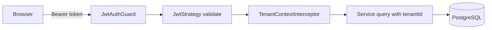

# Architecture notes

## Request and tenancy flow

The browser stores the access token returned by registration/login and sends it as an Authorization bearer token. Nest's JWT guard validates the signature and expiry, then the tenant-context interceptor places the validated `tenantId` in AsyncLocalStorage for the request. Services still use explicit tenant predicates on reads and writes, which makes isolation visible in code and tests.

Authentication and tenant context:

## Backend modules

- `auth`: registration, login, bcrypt password verification, JWT issuance, profile.
- `tenants` and `users`: workspace data, usage, and OWNER-only administration.
- `customers`, `billing`, `dashboard`: tenant-scoped domain operations and derived balances.
- `payments`: provider adapter, intents, refunds, status statistics, and webhook processing.
- `notifications`: outbox statistics, PDF generation, email queueing, and recurring generation.
- `common`: tenant context, validation, rate limiting, and shared request behavior.

## Database design

Prisma maps shared tables for tenants, users, customers, invoices, payments, and outbox events. Foreign keys cascade tenant-owned records where appropriate. Important indexes cover invoice tenant/status and tenant/due-date/status, payment provider idempotency, and tenant/payment status/time. Monetary values are integer minor units.

## Security model

Passwords are bcrypt hashes. JWT secrets, database URLs, Redis credentials, SMTP credentials, and Stripe keys are backend-only environment variables. DTO validation uses a global whitelist/forbid-unknown validation pipe. Protected controllers use JWT guards; workspace and user administration use OWNER role guards. Resource services check both resource ID and tenant ID before reads, updates, or deletes. CORS is restricted to configured frontend origins and known local/deployed Vercel origins.

Stripe webhooks require the raw request body and a valid Stripe signature in configured production environments. Provider payment IDs are unique to make repeated success events idempotent. Webhook and login/registration endpoints have rate limiting; Redis is preferred, with a process-local fallback when unavailable.

## Operations

Run the API and worker as separate processes against the same migrated PostgreSQL and persistent Redis services. Monitor `GET /health`; it reports PostgreSQL and Redis dependency state. Use managed secrets and TLS in deployment. Log configuration and operational identifiers only—never passwords, bearer tokens, payment secrets, or full sensitive bodies.

## Deliberate limitations

Stripe.js confirmation is not part of the current frontend. Provider-initiated charge refunds are logged but not reconciled locally. SMTP, Redis, and worker delivery require real service configuration. These limitations are documented rather than presented as completed production integrations.

