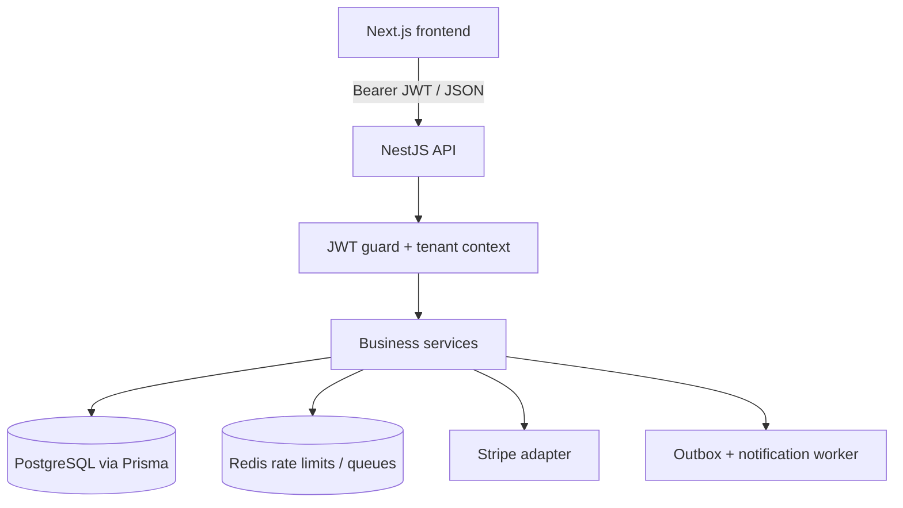
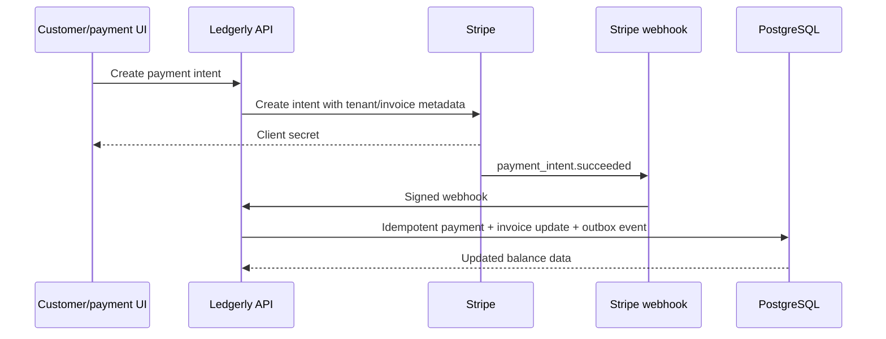

# Ledgerly

Ledgerly is a tenant-isolated SaaS billing workspace for small businesses. It brings customers, invoices, payment tracking, balances, notifications, and workspace administration into one focused dashboard.

## What it demonstrates

- JWT registration, login, session handling, and OWNER/STAFF authorization
- Shared PostgreSQL tables with explicit `tenantId` scoping on domain queries
- Customer CRUD, archive/unarchive, deletion, and derived balances
- Invoice creation, editing, sending, overdue, paid, void, and balance workflows
- Dashboard outstanding, overdue, and paid-this-month totals
- Stripe payment-intent and refund adapters, signed webhook handling, and idempotent provider payment IDs
- Outbox-driven PDF/email notification workflows and a separate worker process
- Redis-backed rate limiting with an in-memory fallback, health checks, validation, and structured logging

Stripe confirmation, production deployment, and email delivery depend on external configuration; they are not claimed as live services in this repository.

## Architecture



Payment flow:



See [ARCHITECTURE.md](ARCHITECTURE.md) for module boundaries, data design, security notes, and operational guidance.

## Technology stack

Next.js 16, React 19, TypeScript, NestJS 10, Prisma 5, PostgreSQL, JWT/passport, bcryptjs, Redis/ioredis, BullMQ, Stripe, PDFKit, Nodemailer, and TurboRepo workspaces.

## Repository structure

```
backend/   NestJS API, Prisma schema/migrations, worker, tests
frontend/  Next.js App Router dashboard
docs/      Optional supporting project material
```

## Local development

Requirements: Node.js, PostgreSQL, and optionally Redis. From the repository root:

```powershell
npm install
Copy-Item backend/.env.example backend/.env
Copy-Item frontend/.env.example frontend/.env.local
# Edit both files with local values
npm --workspace backend run prisma:generate
npm --workspace backend run prisma:migrate
npm run dev
```

Run production processes separately:

```powershell
npm run build
npm run start:api
npm run start:worker
npm run start:frontend
```

Backend commands include `npm run lint`, `npm test -- --runInBand`, `npm run test:e2e`, and `npm run test:phase9`. The health probe is `GET /health`.

## Environment

Backend variables are documented in [backend/.env.example](backend/.env.example): database, JWT, Redis, SMTP, Stripe, CORS, proxy, logging, and rate-limit settings. `JWT_SECRET` must be at least 32 characters in production. Frontend exposes only `NEXT_PUBLIC_API_URL`; never place secrets in `NEXT_PUBLIC_*` variables.

For production, run `npm --workspace backend exec prisma migrate deploy` against a managed PostgreSQL database, configure the backend `FRONTEND_URL`, and use a persistent Redis instance if distributed rate limiting/queues are required.

## API overview

Public: `POST /auth/register`, `POST /auth/login`, `GET /health`, `POST /webhooks/stripe` (signature required).

Protected: `/auth/profile`, `/customers`, `/invoices`, `/dashboard/balance`, `/payments`, `/notifications`, `/tenants/me`, and OWNER-only `/users` and tenant updates. All protected resources require `Authorization: Bearer <token>`.

## Demo walkthrough

1. Register a workspace and sign in.
2. Create a customer, then create an invoice for that customer.
3. Move the invoice through send, overdue/paid, or void actions.
4. Review customer and workspace dashboard balances.
5. If Stripe is configured, create an intent and deliver a signed test webhook; otherwise review the explicit provider configuration state.
6. Open settings to inspect tenant identity, role, plan, and usage.
7. Register a second workspace and verify its customer/invoice lists are isolated.

## Deployment guidance

No deployment is claimed by this repository. A reasonable deployment is Next.js on Vercel, NestJS API/worker on Render, Railway, or AWS, PostgreSQL on Neon/Supabase/managed PostgreSQL, and persistent Redis. Configure secrets in the platform secret manager, run migrations as a release step, and monitor `/health`.

## Known limitations and future work

- Stripe.js payment confirmation is not included in the frontend.
- Provider-initiated `charge.refunded` events are logged but not yet reconciled locally.
- PDF/email delivery requires configured SMTP, Redis, and worker processes.
- The in-memory rate-limit fallback is process-local.
- No benchmark or live production availability claim is made without a configured environment.

## Portfolio description

**Resume (2 lines):** Built Ledgerly, a tenant-isolated SaaS billing platform with a Next.js dashboard and NestJS/Prisma API for customer, invoice, balance, and payment workflows. Implemented JWT/RBAC, PostgreSQL tenant scoping, Stripe webhook processing, outbox notifications, validation, rate limiting, and health checks.

**Resume bullets:**

- Designed shared-table multi-tenancy with JWT-derived tenant context and tenant-scoped customer, invoice, payment, and workspace operations.
- Built invoice lifecycle and derived balance workflows with Prisma/PostgreSQL, Stripe payment-intent/refund adapters, signed webhooks, and idempotent provider IDs.
- Added production-oriented validation, OWNER/STAFF authorization, rate limiting, structured logging, health checks, notification outbox processing, and focused tests.

**GitHub description:** Tenant-isolated Next.js + NestJS SaaS billing platform with JWT auth, Prisma/PostgreSQL, invoice workflows, Stripe adapters, and notification processing.

**LinkedIn:** Ledgerly is a portfolio SaaS billing platform demonstrating tenant isolation, JWT/RBAC, invoice lifecycle management, PostgreSQL/Prisma data modeling, and Stripe webhook-oriented payment processing.

